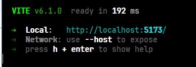

# Project Overview
Bag-It! is an online fashion platform that allows users to browse a vast catalog of clothing through search functions. 
Users can add items to a virtual bag, which can be shared with other users or displayed on their profile.
It offers a diverse range of clothing categories to suit all styles.
To keep up with trends, users can view the most bagged items to see what's baggin' and to inspire their own bags.
Users can also randomize their bags with a single click.
Bag-It! aims to be an accessible and intuitive tool for people who want to put together virtual outfits.

## Clothing Categories
### Sizes
- Extra Small | Small | Medium | Large | Extra Large
### Types
- Shorts | Pants | T-Shirts | Dresses | Shoes | Hats | Hoodies | Shirts
### Colors
- White | Black | Gray | Blue | Red | Green | Pink
### Genders
- Male | Female | Unisex
### Brands
- Nike | Jordan | Tommy Hilfiger | Gucci

## Build Instructions
### Clone the Repository
Open terminal and run the following commands:
```bash
git clone https://github.com/EthanM317/Bag-It
```

### Install Dependencies and Run test Server
This project uses *Node Package Manager (npm)* to manage dependencies. Make sure to install NodeJS before proceeding to the next part of the step.

The batch script `run.bat`, in the root directory, will install all dependencies for you on the first run.
After the dependencies are installed (and on every subsequent run), the script will attempt to start a test server.

On success, it will output something like this:



Paste http://localhost:5173/ into your browser of choice to preview the website.